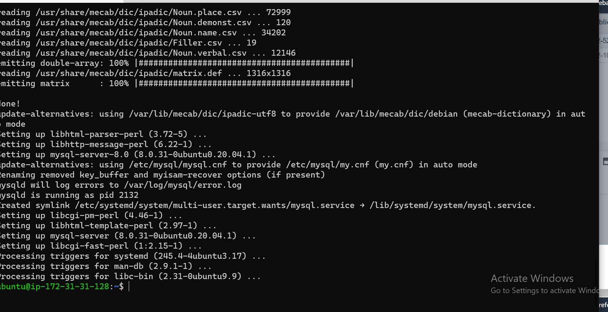
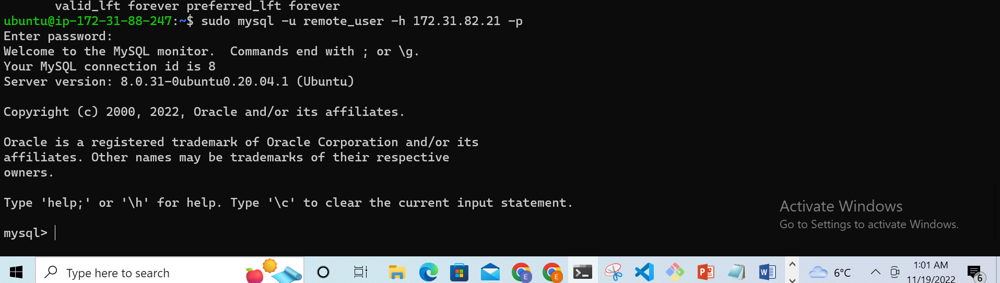
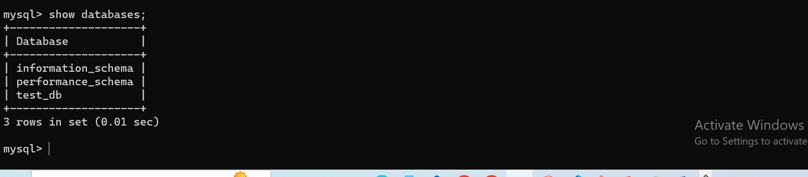

## Create and configure two Linux-based virtual servers (EC2 instances in AWS).

### Server A name - `mysql server`
### Server B name - `mysql client`

### connect the mysql server to your terminal. On mysql server install mysql server using
`sudo apt update -y`
`sudo apt install mysql-server -y`

**Enable the mysql-server service**
`sudo systemctl enable mysql`

### On mysql client Linux Server install MySQL Client software and update .
`sudo apt update`
`sudo apt install mysql-client -y`

**By default, both of your EC2 virtual servers are located in the same local virtual network, so they can communicate to each other using local IP addresses. Use mysql server's local IP address to connect from mysql client. MySQL server uses TCP port 3306 by default, so you will have to open it by creating a new entry in ‘Inbound rules’ in ‘mysql server’ Security Groups. For extra security, do not allow all IP addresses to reach your ‘mysql server’ – allow access only to the specific local IP address of your ‘mysql client’.**

### In editing the inbound rule, in the mysql-server, edit the TYPE to mysql/aurora, in the source section, copy the ip address of the mysql-client and paste there using
`ip addr show` **To get the ip address of the client on the terminal and when it shows, copy the address and end at / then when u paste it in the source section of ur server instance, the add 32 after the / ie 172.31.31.71/32**

### Before we can carry out a remote access, we need to create a database and a user in the mysql server
**First run the security script on the mysql server terminal this helps us to prepare our mysql instance using**
`sudo mysql_secure_installation`
`sudo mysql`
`ALTER USER 'root'@'localhost' IDENTIFIED WITH mysql_native_password BY 'PassWord.1';`
`exit`

`$ sudo mysql_secure_installation`
**Follow the prompt and create a password for the root user**

### Login into mysql
`sudo mysql -p` **Note: the -p will prompt for your password request**

**NOTE: I was using the method in the video but was getting error when trying to set up the password ie after installing mysql-server then I used`sudo mysql_secure_installation` so since I didnt want to use the validate password set up, I pressed any key instaed of Y to continue, it then asked for password for root, which I tried putting but it was throwing error, if the error didnt show, next would have been to follow the prompt and type Y all through. It is better to do it this way than using password for security purposes Then after the set up run the `sudo mysql` command, it will open the mysql without requesting for password because it uses the unique socket to authenticate instead of using password based approach, so when u login in as a root user, u can now create a user following the next step below**

### create a user @ ip address of all ie % and give it your password

`CREATE USER 'remote_user'@'%' IDENTIFIED WITH mysql_native_password BY 'put your password here';`

**create a database**

`CREATE DATABASE test_db;`

**Grant all permissions on the database to the remote user**

 `GRANT ALL ON test_db.* TO 'remote_user'@'%' WITH GRANT OPTION;`

 `FLUSH PRIVILEGES;`

### configure MySQL server to allow connections from remote hosts so open the server config file and edit the bind-address section, u can search for it by typing in /bind, it will show u where u have bind-address then select it,  from 127.0.0.1 to alloww all ip addresses which is 0.0.0.0
`sudo vi /etc/mysql/mysql.conf.d/mysqld.cnf`
**Replace** `‘127.0.0.1’ to ‘0.0.0.0’` **using `dw` to delete that line one by one then `i` to replace with 0.0.0.0 then save and continue with `:wqa`**
**This above will allow all ip addresses**

### From mysql client Linux Server connect remotely to mysql server Database Engine without using SSH. You must use the mysql utility to perform this action using.
 `sudo mysql -u remote_user -h 172.31.82.21 -p`
 **where 172.31.82.21 is the mysql server private ip address, so copy it from your mysql-server instance and paste on your client terminal to connect using the above code**
 

### Check that you have successfully connected to a remote MySQL server and can perform SQL queries using
`Show databases;`
